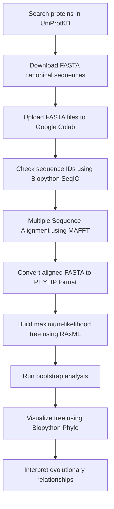

# Phylogenetic Analysis of Kinesin Motor Proteins and Kinesin-14 Family Proteins

This repository contains a Google Colab workflow for constructing phylogenetic trees of selected human kinesin proteins using **Biopython**, **MAFFT**, and **RAxML**. The notebook performs sequence upload, sequence checking, multiple sequence alignment, conversion to PHYLIP format, maximum-likelihood tree construction, bootstrap analysis, and tree visualization.

## Project Objective

The main objective of this work is to build and visualize phylogenetic relationships among two protein datasets:

1. **Kinesin motor proteins**
2. **Selected Kinesin-14 / kinesin-family proteins**

The analysis demonstrates how protein FASTA sequences can be aligned and used to generate bootstrap-supported phylogenetic trees in Google Colab.

## Repository Contents

```text
.
├── Phylogenetic_Tree.ipynb        # Main Google Colab notebook
├── README.md                      # Project documentation
├── kinesin_motor.fasta            # Input FASTA file for kinesin motor proteins
├── kinesin14.fasta                # Input FASTA file for Kinesin-14 / selected kinesin proteins
├── kinesin_motor_aligned.fasta    # MAFFT aligned output for kinesin motor proteins
├── kinesin14_aligned.fasta        # MAFFT aligned output for Kinesin-14 / selected kinesin proteins
├── kinesin_motor_aligned.phy      # PHYLIP file for RAxML
├── kinesin14_aligned.phy          # PHYLIP file for RAxML
└── assets/
    ├── kinesin_motor_tree.png     # Kinesin motor protein tree
    └── kinesin14_tree.png         # Kinesin-14 / selected kinesin protein tree
```

> Note: Some output files are generated automatically when the notebook is executed.

## Tools and Libraries Used

| Tool | Purpose |
|---|---|
| **Google Colab** | Cloud-based Python notebook environment |
| **Biopython** | Reading FASTA files, converting alignments, and drawing trees |
| **MAFFT** | Multiple sequence alignment of protein sequences |
| **RAxML** | Maximum-likelihood phylogenetic tree construction with bootstrap support |
| **Matplotlib** | Figure display and tree plotting |
| **UniProtKB** | Source of protein FASTA sequences |

## Workflow Chart



## Dataset 1: Kinesin Motor Proteins

The first dataset contains 10 selected human kinesin motor proteins. These proteins were downloaded from UniProtKB in FASTA canonical format.

| UniProt ID | Protein Name |
|---|---|
| O00139 | KIF2A_HUMAN |
| O15066 | KIF3B_HUMAN |
| P52732 | KIF11_HUMAN |
| Q02241 | KIF23_HUMAN |
| Q12840 | KIF5A_HUMAN |
| Q96Q89 | KIF20B_HUMAN |
| Q9H1H9 | KIF13A_HUMAN |
| Q9NQT8 | KIF13B_HUMAN |
| Q9P2E2 | KIF17_HUMAN |
| Q9Y496 | KIF3A_HUMAN |

### Kinesin Motor Protein Tree

The following tree was generated using RAxML with bootstrap support and visualized using Biopython.


## Dataset 2: Kinesin-14 / Selected Kinesin-Family Proteins

The second dataset contains 6 selected human kinesin-family proteins used for the Kinesin-14-related analysis in the notebook.

| UniProt ID | Protein Name |
|---|---|
| O14782 | KIF3C_HUMAN |
| O43896 | KIF1C_HUMAN |
| Q15058 | KIF14_HUMAN |
| Q5T7B8 | KIF24_HUMAN |
| Q86VH2 | KIF27_HUMAN |
| Q99661 | KIF2C_HUMAN |

### Kinesin-14 / Selected Kinesin Protein Tree

The following tree was generated using RAxML with bootstrap support and visualized using Biopython.


## Step-by-Step Methodology

### 1. Install Required Packages

The notebook first installs Biopython, MAFFT, and RAxML.

```python
!pip install biopython
!apt-get install -y mafft
!apt-get install -y raxml
```

### 2. Upload FASTA Files

The FASTA files are uploaded into Colab using:

```python
from google.colab import files
uploaded = files.upload()
```

Uploaded input files:

```text
kinesin_motor.fasta
kinesin14.fasta
```

### 3. Confirm Uploaded Files

```python
import os
os.listdir()
```

This confirms that the FASTA files are present in the Colab working directory.

### 4. Check FASTA Sequence IDs

```python
from Bio import SeqIO

for file in ["kinesin_motor.fasta", "kinesin14.fasta"]:
    print("\nFILE:", file)
    for record in SeqIO.parse(file, "fasta"):
        print(record.id)
```

This step confirms that the sequences were correctly read by Biopython.

### 5. Perform Multiple Sequence Alignment Using MAFFT

For kinesin motor proteins:

```python
!mafft --auto kinesin_motor.fasta > kinesin_motor_aligned.fasta
```

For Kinesin-14 / selected kinesin proteins:

```python
!mafft --auto kinesin14.fasta > kinesin14_aligned.fasta
```

MAFFT aligns the amino acid sequences and produces aligned FASTA files.

### 6. Convert FASTA Alignment to PHYLIP Format

RAxML requires PHYLIP format, so the aligned FASTA files are converted using Biopython.

```python
from Bio import AlignIO

alignment = AlignIO.read("kinesin_motor_aligned.fasta", "fasta")
AlignIO.write(alignment, "kinesin_motor_aligned.phy", "phylip-relaxed")

alignment = AlignIO.read("kinesin14_aligned.fasta", "fasta")
AlignIO.write(alignment, "kinesin14_aligned.phy", "phylip-relaxed")
```

### 7. Build Bootstrap-Supported Trees Using RAxML

For kinesin motor proteins:

```python
!raxmlHPC \
-s kinesin_motor_aligned.phy \
-n kinesin_motor_bootstrap \
-m PROTCATJTT \
-p 12345 \
-x 12345 \
-# 20 \
-f a
```

For Kinesin-14 / selected kinesin proteins:

```python
!raxmlHPC \
-s kinesin14_aligned.phy \
-n kinesin14_bootstrap \
-m PROTCATJTT \
-p 12345 \
-x 12345 \
-# 20 \
-f a
```

### Explanation of RAxML Parameters

| Parameter | Meaning |
|---|---|
| `-s` | Input alignment file in PHYLIP format |
| `-n` | Output run name |
| `-m PROTCATJTT` | Protein substitution model using CAT approximation and JTT matrix |
| `-p 12345` | Random seed for parsimony starting tree |
| `-x 12345` | Random seed for bootstrap analysis |
| `-# 20` | Number of bootstrap replicates used in this notebook |
| `-f a` | Rapid bootstrap analysis followed by best-scoring maximum-likelihood tree search |

> For a stronger final analysis, the bootstrap number can be increased from `20` to `100`, but this will take more time in Colab.

### 8. Visualize Trees with Bootstrap Values

```python
from Bio import Phylo
import matplotlib.pyplot as plt

tree = Phylo.read(
    "RAxML_bipartitions.kinesin_motor_bootstrap",
    "newick"
)

fig = plt.figure(figsize=(15,10))
ax = fig.add_subplot(1,1,1)

ax.set_title(
    "Phylogenetic Tree of Kinesin Motor Proteins\nwith Bootstrap Support",
    fontsize=16,
    fontweight='bold'
)

Phylo.draw(
    tree,
    axes=ax,
    branch_labels=lambda c: c.confidence
)

plt.show()
```

The same visualization approach is used for the Kinesin-14 / selected kinesin-family tree by changing the input tree file and title.

## Results Summary

### Kinesin Motor Protein Tree

The kinesin motor protein tree shows clustering patterns among selected members of the kinesin superfamily. Closely grouped proteins are likely to share greater sequence similarity and possible functional conservation. More distant branches indicate greater sequence divergence.

### Kinesin-14 / Selected Kinesin Protein Tree

The second tree shows relationships among the selected kinesin-family proteins. Bootstrap values are displayed at internal branches and indicate the level of support for each clade. Higher bootstrap values suggest stronger confidence in the branching pattern.

## Interpretation of Bootstrap Values

Bootstrap values help evaluate the reliability of each branch in the tree.

| Bootstrap Value | Interpretation |
|---|---|
| 90–100 | Very strong support |
| 70–89 | Good support |
| 50–69 | Moderate support |
| Below 50 | Weak support |

In this notebook, some branches show high bootstrap values, meaning those groupings are well supported by the sequence alignment and RAxML analysis.

## Important Notes

- The analysis uses protein sequences, not DNA sequences.
- FASTA files must contain real amino acid sequences, not only protein names.
- The notebook uses `PROTCATJTT` because it runs faster in Colab than `PROTGAMMAJTT`.
- Increasing bootstrap replicates from `20` to `100` improves reliability but increases runtime.
- The tree topology depends on sequence selection, alignment quality, and model settings.

## Conclusion

This project successfully demonstrates a complete phylogenetic analysis workflow for selected kinesin proteins. Protein sequences were retrieved from UniProtKB, aligned with MAFFT, converted into PHYLIP format, analyzed with RAxML, and visualized using Biopython. The resulting trees provide an overview of evolutionary relationships among the selected kinesin motor proteins and Kinesin-14 / related kinesin-family proteins.

## References

1. UniProt Consortium. UniProt: the Universal Protein Knowledgebase.
2. Katoh, K. and Standley, D.M. MAFFT Multiple Sequence Alignment Software Version 7.
3. Stamatakis, A. RAxML version 8: a tool for phylogenetic analysis and post-analysis of large phylogenies.
4. Cock, P.J.A. et al. Biopython: freely available Python tools for computational molecular biology and bioinformatics.
